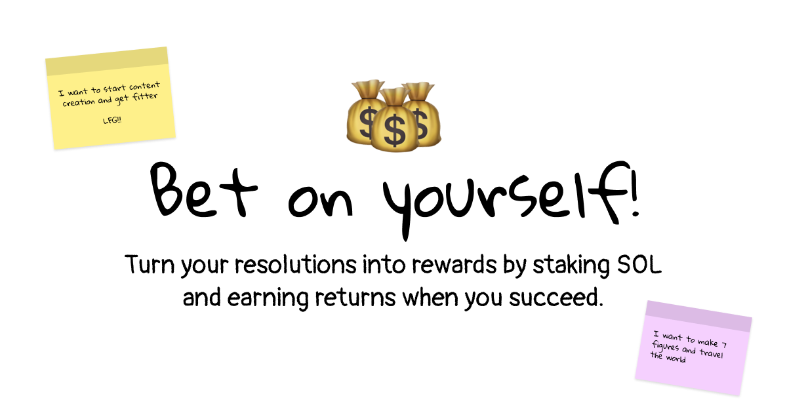

# reSOLution - Stake on Your Goals

Resolution is a Solana-based dApp that helps you commit to your goals by putting your money where your mouth is. Stake SOL on your resolutions and earn rewards for achieving them!

## How It Works

1. **Create a Resolution**
   - Set a resolution with a specific goal and timeframe
   - Stake SOL tokens as commitment
   - Choose 3 unique approvers who will verify your achievement
   - Your stake is automatically delegated to a Solana validator

2. **Earn While You Achieve**
   - Your staked SOL earns staking rewards during the resolution period
   - Stay motivated knowing your money is on the line

3. **Complete Your Resolution**
   - Get approval from your chosen verifiers
   - Need at least all 3 approvers to confirm completion

4. **Outcome**
   - **Success**: Receive back your initial stake + all staking rewards
   - **Failure**: Get back only your initial stake, rewards are burned 🔥

## Features

- **Trustless Verification**: Requires 3 independent approvers
- **Productive Staking**: Earn validator rewards while committed
- **Time-Locked**: Funds are locked until resolution end date
- **Incentive Alignment**: Burn mechanism for incomplete resolutions

## Technical Details

The smart contract includes the following main functions:

- `initialize_resolution`: Create a new resolution with stake and approvers
- `approve_resolution`: Approvers can verify completion
- `deactivate_resolution_stake`: Deactivate staking when resolution ends
- `close_resolution`: Claim funds based on resolution outcome

